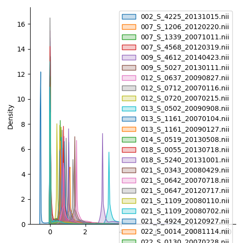
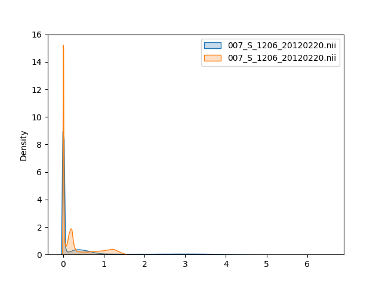
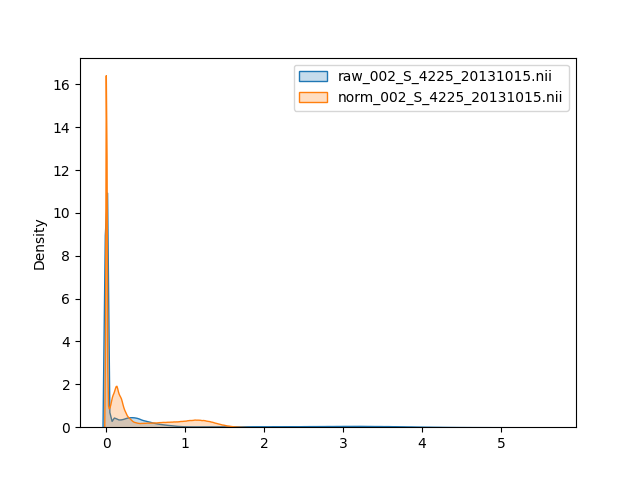
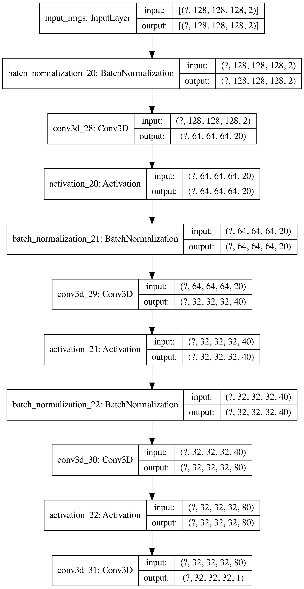
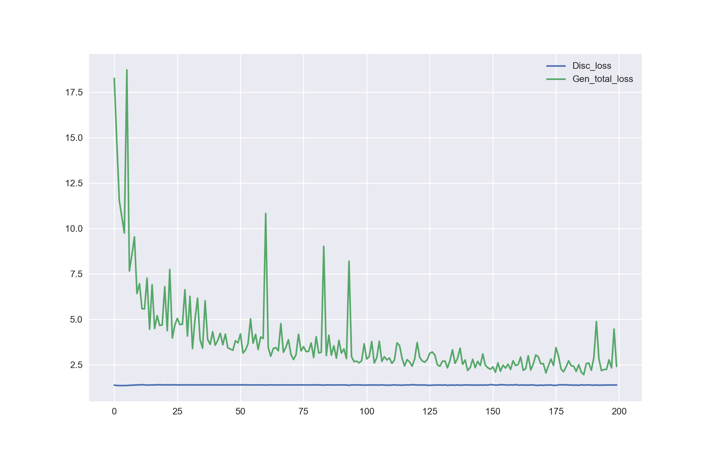
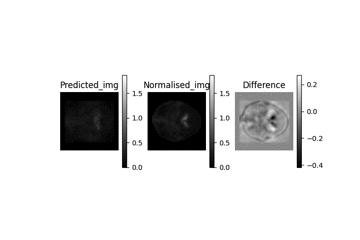

# Project 2: One step image registration for Positron Emission Tomography (PET) image using GAN

## Summary
In this project, I used general advasarial network (GAN) to simplify the PET and MRI image coregistration
</br>
All the image data used in this project are from [ADNI dataset](http://adni.loni.usc.edu), in this study I used 100 Raw PET 3D Neuro Dynamic images and their coresponding Co-Registered Processed PET images.

### Phase 1: Check the data

Fig 1. The data distribution of raw images </br>



I know that the range for each image are different.

### Phase 2: Data_Cleaning, Data_preprocessing

From Phase 1, I know the data is complicated.</br>
To simplify the data, I selected the data with identical distribution and the image size less than (128, 128, 128) </br>
Then standardised Raw PET 3D Neuro Dynamic images based on the preproceesing steps that listed on ADNI website.</br>

Here's the results of the pre-processed data

Fig 2. The data distribution of preprocessed raw data and target data </br>





### Phase 3: Construct a pix2pix model using Tensorflow

The original paper of pix2pix can be seen at [here](https://arxiv.org/abs/1611.07004)</br>
In my project, I modified the generator into a self-constructed volumetric [U-Net](https://arxiv.org/abs/1505.04597)</br>
The discriminator is another self-constructed volumetric Convolutional Neural Network (CNN)

The overall architectures of generators and discriminators can be seen at Figure 3 and 4

Fig 3. The architecture of generator <br>


Fig 4. The architecture of discriminator <br>


Fig 5. The learning curve of pix2pix model </br>




### Phase 4: Evaluate the model
Finally, here's the comparison between the predicted image and the target normalised image

Fig 6. Results </br>


## Usage

### Clone the repository:

```bash
git clone https://github.com/Kaiyilin/oneStepNorm
cd oneStepNorm
```

### Modify the configuration:

<p> The data are from public ADNI dataset, you can download it online </p>
<p> Remember to modify the data path </p>

```bash
cd configs
vim configs.py
```

### Training the network:

<p> You can use pre-define value </p>

```bash
python main.py
```

<p> Or </p>

<p> You can use your own combinations like</p>

```bash
python main.py --log_path ./logs \
               --ckpt_path ./ckpt_path \
               --gen_filter_nums 10 \
               --disc_filter_nums 10 \
               --kernel_size 4 \
               --g_lr 1e-5 \
               --d_lr 1e-6 \
               --lambda 150 \
               --batchsize 2 \
               --epochs 150 \
```

### Test:

```bash
python evaluation/evaluate.py
```

### TODO

<ul>
  <li> Reduce the size of model </li>
  <li> Deploy the model in an efficient way, I tried Flask but it's unacceptably slow </li>
</ul>
